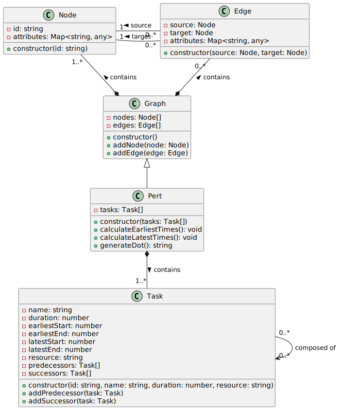

# PERT Diagram Generator Web App


## Introduction

This project is a web application that generates a PERT (Program Evaluation and Review Technique) diagram from user-defined tasks, leveraging Model-Driven Engineering (MDE) principles. The primary objective is to simplify project management by automating the visualization of task dependencies, durations, and sequences. The PERT diagram helps in identifying critical paths, optimizing task schedules, and improving time management for complex projects.

### Why Model-Driven Engineering (MDE)?

MDE provides a structured approach to design and implement solutions through high-level modeling, minimizing manual coding and reducing errors. By using MDE, we achieve a more flexible, maintainable, and scalable solution that focuses on models to drive application logic. This approach makes the generation of diagrams like PERT not only quicker but also adaptable to changes, ensuring that any model alteration is instantly reflected in the diagram output.

## Application Requirements

In this section, both functional and non-functional requirements are outlined to comprehensively delineate the system's operational and performance parameters.

### Functional Requirements

1. **Task Input and Management**:

   - Users should be able to input tasks with details like name, duration, and dependencies.
   - The app should validate inputs to ensure all dependencies form a viable PERT structure.

2. **PERT Diagram Generation**:

   - The application should generate a PERT diagram based on user inputs.
   - Users should be able to view the generated diagram visually, with clear task nodes and dependency lines.

3. **Export Options**:

   - Users should have the option to export the generated PERT diagram as an image or PDF.

4. **Error Handling**:
   - The application should provide feedback if there are issues with task dependencies or input format, guiding the user to correct them.

### Non-Functional Requirements

1. **Performance**:

   - The application should generate the PERT diagram within a few seconds, even for a large number of tasks.

2. **Scalability**:

   - The system should support multiple users simultaneously without affecting performance.

3. **Security**:

   - User inputs and generated diagrams should be processed securely, with minimal data storage.

4. **Usability**:

   - The interface should be intuitive and easy to navigate, allowing users to create and visualize PERT diagrams without needing extensive instructions.

5. **Reliability**:

   - The application should consistently generate accurate PERT diagrams, with minimal downtime or errors.

6. **Compatibility**:
   - The web app should be compatible across modern browsers (Chrome, Firefox, Safari) and devices (desktop, tablet, mobile).

## Class Diagrams

<details>
<summary>Click to view the Class Diagram</summary>

<div align="center">

<p>Meta-metamodel & Metamodel</p>
</div>
<br>


</details>

## Development Tools

- **Node.js**: For server-side JavaScript execution.
- **Express.js**: Simplifies routing and API handling.
- **React**: Builds the user interface with real-time updates.
- **TypeScript**: Provides type safety across the project.
- **.dotfile**: Configuration for Graphviz diagrams.
- **Graphviz**: Creates visual PERT diagrams from `.dot` representations.

## How to Run the App

1. **Clone the Repository**:  
   Clone the project repository to your local machine using the following command:

   ```bash
   git clone https://github.com/gl-s5-task-force/pert-diagram-mde.git
   ```

2. **Install Dependencies**:  
   Install all necessary dependencies for the project by running:

   ```bash
   # Front
   npm install

   # Back
   cd server
   npm install
   cd ..
   ```

3. **Set Up Graphviz**:  
   Ensure Graphviz is installed on your machine, as it is required for generating PERT diagrams. You can follow the installation instructions at Graphviz's official site: https://graphviz.org/download/

4. **Start the Application**:  
   Start the application in development mode by running 
   ```bash 
   $ ./start
   ```

5. **Access the Application**:  
   Open a web browser and navigate to `http://localhost:5173` to access the application.

6. **Generate the PERT Diagram**:
   - Enter tasks and their dependencies in the input form provided on the homepage.
   - Click "Submit" to view the PERT diagram based on the provided input.

7. **Results**:

<div align="center">
   
</div>

<div align="center">
   
</div>

<div align="center">
   
</div>
